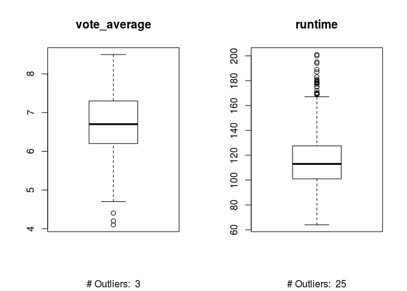
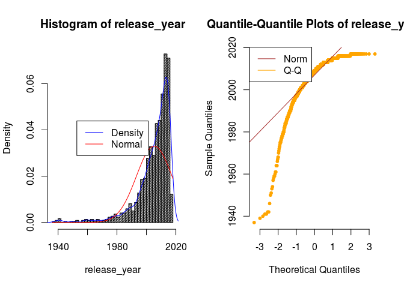

La Base de Datos sobre Películas
================
Efraín Lima Miranda
2 de enero de 2018

-   [La Base de Datos sobre Películas](#la-base-de-datos-sobre-películas)
-   [Descripción del *dataset*](#descripción-del-dataset)
-   [Limpieza de los datos.](#limpieza-de-los-datos.)
    -   [Tabla con los números de Tukey](#tabla-con-los-números-de-tukey)
-   [Análisis de los datos.](#análisis-de-los-datos.)
    -   [Comprobación de la normalidad](#comprobación-de-la-normalidad)
    -   [Homogeneidad de la varianza](#homogeneidad-de-la-varianza)
    -   [Pruebas estadísticas](#pruebas-estadísticas)
-   [Tablas y gráficas](#tablas-y-gráficas)
    -   [Tablas Top5](#tablas-top5)
    -   [Histogramas temporales](#histogramas-temporales)
-   [Conclusiones](#conclusiones)

La Base de Datos sobre Películas
--------------------------------

> Descripción del dataset. ¿Por qué es importante y qué pregunta/problema pretende responder?

El cine siempre es un tema de actualizad y desde que Hollywood lo convirtió en una industria del entretenimiento, ésta nunca ha parado de crecer. El *dataset* propuesto es un conjunto de datos recopilados por TMDb (<https://www.themoviedb.org/>) y GroupLends (<https://grouplens.org/datasets/movielens/>) que contiene los detalles de las películas, créditos y las palabras clave así como estadîsticas de las valoraciones de los usuarios. Los datos se han obtenido a través de la API proporcionada por TMDb (<https://www.themoviedb.org/documentation/api>). Además de estos datos se han añadido películas, miembros del reparto y créditos así como algunos programas de televisión.

A partir de este conjunto de datos se pretende estudiar la evolución de la industria cinematográfica a lo largo de la historia. Nos centraremos en la influencia de los ingresos obtneidos con las puntuaciones del público.

los la rentabilidad a lo largo de la historia de las películas dependiendo de los atributos proporcionados por el *dataset*.

Descripción del *dataset*
=========================

<table>
<colgroup>
<col width="24%" />
<col width="58%" />
<col width="17%" />
</colgroup>
<thead>
<tr class="header">
<th>Atributo</th>
<th>Descripción</th>
<th>Tipo</th>
</tr>
</thead>
<tbody>
<tr class="odd">
<td><strong>adult</strong></td>
<td>Indica si la película es valorada como X o para adultos.</td>
<td>Boolean</td>
</tr>
<tr class="even">
<td><strong>belongs_to_collection</strong></td>
<td>Diccionario con la infomacion sobre a qué colección pertenece la película.</td>
<td>List )Strings)</td>
</tr>
<tr class="odd">
<td><strong>budget</strong></td>
<td>El presupuesto total en dólares.</td>
<td>Float</td>
</tr>
<tr class="even">
<td><strong>genres</strong></td>
<td>Lista de diccionarios donde se listan todos los generos asignados a la película.</td>
<td>List (Strings)</td>
</tr>
<tr class="odd">
<td><strong>homepage</strong></td>
<td>Página oficial de la película.</td>
<td>String</td>
</tr>
<tr class="even">
<td><strong>id</strong></td>
<td>ID de la película.</td>
<td>String</td>
</tr>
<tr class="odd">
<td><strong>imdb_id</strong></td>
<td>IMDB ID de la película.</td>
<td>String</td>
</tr>
<tr class="even">
<td><strong>original_language</strong></td>
<td>Idioma original en el que rodó la película.</td>
<td>String (factor)</td>
</tr>
<tr class="odd">
<td><strong>original_title</strong></td>
<td>Título original de la película.</td>
<td>String</td>
</tr>
<tr class="even">
<td><strong>overview</strong></td>
<td>Reseña breve sobre la película.</td>
<td>String</td>
</tr>
<tr class="odd">
<td><strong>popularity</strong></td>
<td>La puntuación de popularidad de TMDb.</td>
<td>Float</td>
</tr>
<tr class="even">
<td><strong>poster_path</strong></td>
<td>URL del póster de la película.</td>
<td>String</td>
</tr>
<tr class="odd">
<td><strong>production_companies</strong></td>
<td>Lista de compañías de producción involucradas en la películas.</td>
<td>List (Strings)</td>
</tr>
<tr class="even">
<td><strong>production_countries</strong></td>
<td>Lista de países donde la película ha sido producida.</td>
<td>List (Strings)</td>
</tr>
<tr class="odd">
<td><strong>release_date</strong></td>
<td>Fecha de lanzamiento de la película.</td>
<td>Date</td>
</tr>
<tr class="even">
<td><strong>revenue</strong></td>
<td>Total de ingresos en dólares.</td>
<td>Float</td>
</tr>
<tr class="odd">
<td><strong>runtime</strong></td>
<td>Duración de la película en minutos.</td>
<td>Float</td>
</tr>
<tr class="even">
<td><strong>spoken_languages</strong></td>
<td>Lista de los idiomas hablados en la película.</td>
<td>List (Strings)</td>
</tr>
<tr class="odd">
<td><strong>status</strong></td>
<td>Estado de la película: (Released, To Be Released, Announced, etcétera).</td>
<td>String (factor)</td>
</tr>
<tr class="even">
<td><strong>tagline</strong></td>
<td>Eslogan de la película.</td>
<td>String</td>
</tr>
<tr class="odd">
<td><strong>title</strong></td>
<td>Título oficial de la película.</td>
<td>String</td>
</tr>
<tr class="even">
<td><strong>video</strong></td>
<td>Indica existe un vídeo en TMDb</td>
<td>Boolean</td>
</tr>
<tr class="odd">
<td><strong>vote_average</strong></td>
<td>Media de las valoraciones de la película</td>
<td>Float</td>
</tr>
<tr class="even">
<td><strong>vote_count</strong></td>
<td>Número de votos de los usuarios de TMBD</td>
<td>Integer</td>
</tr>
</tbody>
</table>

``` r
file_data_path  = "../dataset/movies_metadata.csv"
data_movies = read.csv2(file=file_data_path,
                        sep=',', 
                        header=TRUE, dec='.',
                        strip.white=TRUE)
```

``` r
sapply(data_movies, class)
```

    ##                 adult belongs_to_collection                budget 
    ##              "factor"              "factor"              "factor" 
    ##                genres              homepage                    id 
    ##              "factor"              "factor"              "factor" 
    ##               imdb_id     original_language        original_title 
    ##              "factor"              "factor"              "factor" 
    ##              overview            popularity           poster_path 
    ##              "factor"              "factor"              "factor" 
    ##  production_companies  production_countries          release_date 
    ##              "factor"              "factor"              "factor" 
    ##               revenue               runtime      spoken_languages 
    ##             "numeric"             "numeric"              "factor" 
    ##                status               tagline                 title 
    ##              "factor"              "factor"              "factor" 
    ##                 video          vote_average            vote_count 
    ##              "factor"             "numeric"             "integer"

``` r
sapply(data_movies, typeof)
```

    ##                 adult belongs_to_collection                budget 
    ##             "integer"             "integer"             "integer" 
    ##                genres              homepage                    id 
    ##             "integer"             "integer"             "integer" 
    ##               imdb_id     original_language        original_title 
    ##             "integer"             "integer"             "integer" 
    ##              overview            popularity           poster_path 
    ##             "integer"             "integer"             "integer" 
    ##  production_companies  production_countries          release_date 
    ##             "integer"             "integer"             "integer" 
    ##               revenue               runtime      spoken_languages 
    ##              "double"              "double"             "integer" 
    ##                status               tagline                 title 
    ##             "integer"             "integer"             "integer" 
    ##                 video          vote_average            vote_count 
    ##             "integer"              "double"             "integer"

Limpieza de los datos.
======================

> Selección de los datos de interés a analizar. ¿Cuáles son los campos más relevantes para responder al problema? ¿Los datos contienen ceros o elementos vacíos? ¿Y valores extremos? ¿Cómo gestionarías cada uno de estos casos?

Inicialmente usaremos para nuestro problema los datos que relacionados con aspectos económicos (budget, revenue), de aceptación por el público (popularity, vote\_count, vote\_average) y algunas características de las películas (title, runtime, release\_date)

``` r
columns <- c('title', 'imdb_id', 'budget' , 'revenue', 'popularity', 'vote_count', 'vote_average', 'title', 'runtime', 'release_date')
movies <- data_movies[ , columns]
```

Al analizar visualmente el *dataset* nos encontramos con que hay tres entradas donde los datos no se han grabado correctamente. (por ejemplo la entrada con el índice número 35588).

Consultando manualmente los datos de la tabla se observa que las entradas erróneas aparecen como desplazadas 4 posiciones a la izquierda y le faltan muchos datos claves como el identificadorp . Al ser sólo tres entradas del conjunto de datos y de las que no tenemos información suficiente para su recuperación, las ignoraremos.

``` r
bad_index <- (data_movies$adult != 'True' & data_movies$adult != 'False')
movies <- movies[!bad_index, ]
```

Para evitar confusiones con los valores numéricos que son Null, vacíos, con los valores 0 los transformamos a NA:

``` r
# budget, popularity, revenue, runtime
movies$budget  <- as.numeric(as.character(movies$budget))
movies$popularity <- as.numeric(as.character(movies$popularity))
movies$revenue  <- as.numeric(as.character(movies$revenue))
movies$runtime  <- as.numeric(as.character(movies$runtime))

movies$budget[movies$budget == 0] <- NA
movies$popularity[movies$popularity == 0] <- NA
movies$revenue[movies$revenue == 0] <- NA
movies$runtime[movies$runtime == 0] <- NA
```

Las películas sin títulos las consideramos no válidas, las eliminamos:

``` r
movies <- movies[movies$title != '', ]
movies$title <- as.character(movies$title)
```

También convertimos la fecha de release en el tipo Date, los datos vacíos se convierten a NA automáticamente:

``` r
movies$release_date <- as.Date(as.character(movies$release_date))
```

Para simplificar el estudio de los datos se añade una columna nueva para los años.

``` r
movies$release_year <- as.numeric(format(movies$release_date, "%Y"))
```

``` r
sapply(movies, typeof)
```

    ##        title      imdb_id       budget      revenue   popularity 
    ##  "character"    "integer"     "double"     "double"     "double" 
    ##   vote_count vote_average      title.1      runtime release_date 
    ##    "integer"     "double"    "integer"     "double"     "double" 
    ## release_year 
    ##     "double"

``` r
sapply(movies, class)
```

    ##        title      imdb_id       budget      revenue   popularity 
    ##  "character"     "factor"    "numeric"    "numeric"    "numeric" 
    ##   vote_count vote_average      title.1      runtime release_date 
    ##    "integer"    "numeric"     "factor"    "numeric"       "Date" 
    ## release_year 
    ##    "numeric"

Con los datos ya limpios estudiamos los valores *outliers* del *dataset* para los atributos relevantes: budget y revenue.

Consultando los datos de budget nos encontramos con valores un tanto sospechosos, valores muy bajos de dólares son anormales en la realidad el cine. Lo mismo podríamos decir de los valores de revenue. Estos *outliers* pueden deberse a un fallo en la conversión a un valor actual por la inflación de la moneda o simplemente a un error durante el proceso de captura. Dado lo costoso que sería una investigación de los problemas concretos, se ha optado por establecer un límite mínimo.

``` r
movies <- movies[!is.na(movies$budget), ]
movies <- movies[!is.na(movies$revenue), ]

budget <- movies$budget[movies$budget < 200 & !is.na(movies$budget)]
revenue <- movies$revenue[movies$revenue < 200 & !is.na(movies$revenue)]


hist(budget, breaks=20)
```


``` r
hist(revenue, breaks=20)
```


Observando los histogramas para valores menores de 200 para el budget y el revenue consideramos sólo las películas con budget y revenue superior a 200.

``` r
movies <- movies[movies$budget > 200 & !is.na(movies$budget), ]
movies <- movies[movies$revenue > 200 & !is.na(movies$revenue), ]
```

Aunque con esta limpieza se haya reducido el número de instancias que tenemos como entrada, sus valores son consistentes y, aparentemente, reales.

|       | title                                | imdb\_id  |    budget|   revenue|  popularity|  vote\_count|  vote\_average| title.1                              |  runtime| release\_date |  release\_year|
|-------|:-------------------------------------|:----------|---------:|---------:|-----------:|------------:|--------------:|:-------------------------------------|--------:|:--------------|--------------:|
| 30040 | Plus one                             | tt1224449 |    336029|    927277|    0.562568|            6|            4.0| Plus one                             |       NA| 2008-08-21    |           2008|
| 30195 | Tutto tutto niente niente            | tt2456720 |   5579750|   8927600|    2.208906|           54|            4.8| Tutto tutto niente niente            |       NA| 2012-11-30    |           2012|
| 31069 | Shabd                                | tt0409527 |   2500000|   3100000|    0.922522|            1|            5.0| Shabd                                |       NA| 2005-02-04    |           2005|
| 31519 | The Worst Christmas of My Life       | tt2550838 |   6843500|  10703234|    3.800073|           86|            5.5| The Worst Christmas of My Life       |       NA| 2012-12-22    |           2012|
| 31527 | La peggior settimana della mia vita  | tt2076251 |  11000000|  12935800|    5.010563|           96|            5.9| La peggior settimana della mia vita  |       NA| 2011-10-27    |           2011|
| 34282 | Shikshanachya Aaicha Gho             | tt2321513 |    380000|    520000|    0.043519|            1|            8.0| Shikshanachya Aaicha Gho             |       NA| 2010-01-15    |           2010|
| 35026 | The Last Breath                      | tt0191076 |   3800000|    559298|    0.072704|            2|            4.0| The Last Breath                      |       NA| 1999-03-25    |           1999|
| 43393 | Королёв                              | tt1107828 |   6000000|     31000|    0.292296|            1|            1.0| Королёв                              |       NA| 2007-10-29    |           2007|
| 43994 | Hooked on the Game 2. The Next Level | tt1620549 |   3500000|   2294357|    0.884241|           14|            5.1| Hooked on the Game 2. The Next Level |       NA| 2010-04-15    |           2010|
| 44104 | Mechenosets                          | tt0477337 |   5000000|   3919731|    0.414793|            7|            5.6| Mechenosets                          |       NA| 2006-10-12    |           2006|
| 44153 | Glukhar v kino                       | tt1620464 |   2500000|   1477030|    0.209434|            4|            5.9| Glukhar v kino                       |       NA| 2010-05-06    |           2010|

A pesar de eso, hay 11 instancias donde el runtime no aparece, consultando la base de datos de IMDB manualmente (<http://www.imdb.com/>) completamos estos datos:

``` r
movies$runtime[movies$imdb_id=='tt1224449'] = 96
movies$runtime[movies$imdb_id=='tt2456720'] = 96
movies$runtime[movies$imdb_id=='tt0409527'] = 140
movies$runtime[movies$imdb_id=='tt2550838'] = 86
movies$runtime[movies$imdb_id=='tt2076251'] = 93
movies$runtime[movies$imdb_id=='tt2321513'] = 103
movies$runtime[movies$imdb_id=='tt0191076'] = 104
movies$runtime[movies$imdb_id=='tt1107828'] = 130
movies$runtime[movies$imdb_id=='tt1620549'] = 86
movies$runtime[movies$imdb_id=='tt0477337'] = 108
movies$runtime[movies$imdb_id=='tt1620464'] = 93
```

Ahora tenemos el conjunto de datos completo:

``` r
incomplete <- movies[!complete.cases(movies), ]
nrow(incomplete) == 0
```

    ## [1] TRUE

En los datos actuales nos encontramos con el problema del valor medio de las votaciones para elementos donde éstas no son muy numerosas. Por ejemplo, si una película tiene muy pocos votos con una valoración alta, la media de esta podría no ser representativa Establecemos el límite mínimo de 1000 votos para nuestra muestra.

``` r
movies <- movies[order(-movies$vote_count), ]
movies = movies[movies$vote_count > 1000, ]
```

Para facilitar el estudio de este *dataset* se calcula una nueva característica que indica si la película se puede cosiderar de la generación actual.

``` r
movies$old <- !movies$release_date > 1990
```

### Tabla con los números de Tukey

|               |          mean|      minimum|  lower-hinge|        median|   upper-hinge|       maximum|
|---------------|-------------:|------------:|------------:|-------------:|-------------:|-------------:|
| budget        |  7.059786e+07|  1.50000e+04|  2.30000e+07|  5.250000e+07|  1.025000e+08|  3.800000e+08|
| revenue       |  2.811946e+08|  5.01818e+05|  9.92626e+07|  2.015963e+08|  3.666883e+08|  2.787965e+09|
| popularity    |  1.872167e+01|  3.93865e-01|  1.10677e+01|  1.402674e+01|  1.818866e+01|  5.474883e+02|
| vote\_count   |  2.555215e+03|  1.00500e+03|  1.35250e+03|  1.890000e+03|  3.086500e+03|  1.407500e+04|
| vote\_average |  6.767243e+00|  4.10000e+00|  6.20000e+00|  6.700000e+00|  7.300000e+00|  8.500000e+00|
| runtime       |  1.160355e+02|  6.40000e+01|  1.01000e+02|  1.130000e+02|  1.275000e+02|  2.010000e+02|
| release\_year |  2.005292e+03|  1.93700e+03|  2.00100e+03|  2.009000e+03|  2.013000e+03|  2.017000e+03|

``` r
par(mfrow = c(1, 2))
for (i in 1:length(movies)) {
  df <- movies[, i]
  if(is.numeric(df)) {
    boxplot(df, main=names(movies[i]), type="l", plot=TRUE, sub=paste("# Outliers: ", length(boxplot.stats(df)$out)))
  }
}
```



Consultando la tabla con el resumen con los números de Tukey y los *boxplots* se pueden observar como hay muchos valores que podrían ser *outliers*. Si observamos más detenidamente estos valores nos damos cuenta que, a pesar de ser *valores extremos*, son válidos y enriquecen con su diversidad la muestra. Por lo tanto, no realizamos ninguna actividad sobre ellos. Un ejemplo de esta situación son los referidos a *release\_year*, los valores mostrados como *outliers* son consecuencia de las votaciones que realizan mayoritariamente sobre películas actuales, pero sin olvidar los clásicos de la industria.

Análisis de los datos.
======================

> Selección de los grupos de datos que se quieren analizar/comparar. Comprobación de la normalidad y homogeneidad de la varianza. Si es necesario (y posible), aplicar transformaciones que normalicen los datos. Aplicación de pruebas estadísticas (tantas como sea posible) para comparar los grupos de datos.

Comprobación de la normalidad
-----------------------------

Para comprobar la normalidad mostraremos los histogramas juntos con su función de densidad y de la normal con la media y varianza correspondiente. A la derecha del histograma se dibuja también la gráfica Q-Q (Quantile-Quantile Plot) junto con la línea Q de la distribución normal.

``` r
library(nortest)

par(mfrow = c(1, 2))

for (i in 1:length(movies)) {
  data <- movies[, i]
  
  if(is.numeric(data)) {
    label = names(movies[i])
    # Histogram
    hist(data, density=50, breaks=50, xlab=label, main=paste('Histogram of', label), freq=FALSE)
    
    lines(density(data), col='blue')
    curve(dnorm(x, mean=mean(data), sd=sd(data)), add=TRUE, col='red')
    legend("center", c("Density", "Normal"), col=c("blue", "red"), lwd=1)
    
    # Anderson-Darling normality test
    main_label <- paste('Quantile-Quantile Plots of', label)
    x_label <- paste("Theoretical Quantiles")
    qqnorm(data, col="orange", pch=20, main=main_label, xlab=x_label, frame.plot = FALSE)
    qqline(data, col="brown", distribution=qnorm)
    legend("topleft", c("Norm", "Q-Q"), col=c("brown", "orange"), lwd=1)
  }
}
```



``` r
library(nortest)
library(e1071)                    

test_in_df <- function(test_name) {
    result <- lapply(movies, function(test_data){
        if(is.numeric(test_data)) {
          result_test <- do.call(test_name, list(test_data))
          c(result_test[0], result_test[1], result_test[2])
        }
        
    })
    result <- result[lapply(result,length)>0]
    
    result_df <- do.call(rbind.data.frame, result)
    return(result_df)
}

ad_test <- test_in_df('ad.test')
shapiro_test <- test_in_df('shapiro.test')
```

``` r
kable(ad_test)
```

|               |   statistic|   p.value|
|---------------|-----------:|---------:|
| budget        |   35.462217|  0.00e+00|
| revenue       |   58.171389|  0.00e+00|
| popularity    |  220.742542|  0.00e+00|
| vote\_count   |   74.184439|  0.00e+00|
| vote\_average |    2.206254|  1.34e-05|
| runtime       |    8.571146|  0.00e+00|
| release\_year |   60.893710|  0.00e+00|

``` r
kable(shapiro_test)
```

|               |  statistic|  p.value|
|---------------|----------:|--------:|
| budget        |  0.8912420|  0.0e+00|
| revenue       |  0.7877348|  0.0e+00|
| popularity    |  0.2880532|  0.0e+00|
| vote\_count   |  0.7650603|  0.0e+00|
| vote\_average |  0.9915117|  5.8e-06|
| runtime       |  0.9640024|  0.0e+00|
| release\_year |  0.7692271|  0.0e+00|

Observando las gráficas mostradas anteriormente podríamos afirmar a simple vista que las variables vote\_average y runtime siguen una distribución normal. Cuando comprobamos analíticamente la normalidad de los datos usando los tests Shapiro (Shapiro <https://en.wikipedia.org/wiki/Shapiro%E2%80%93Wilk_test>) y Anderson-Darling (<https://en.wikipedia.org/wiki/Anderson%E2%80%93Darling_test>) solamente en vote\_average nos encontramos con un p-valor superior a 0.05, es decir, podemos aceptar la hipótesis de normalidad para esta variables.

Homogeneidad de la varianza
---------------------------

A través de boxplots comprobamos la homogenidad de la varianza (homocedasticidad) de las películas etiquetadas como antiguas y las nuevas.

``` r
library(ggplot2)

for (i in 1:length(movies)) {
  data <- movies[, i]
  label = names(movies[i])

  if(is.numeric(data)) {
    print(ggplot(data = movies, aes(x = old, y = data, colour = old, main=label)) + 
            geom_boxplot() + theme_bw() + labs(title = label))
  }
}
```


``` r
var_test_df <- function() {
  
    result <- lapply(movies, function(data){
        if(is.numeric(data)) {
          result_test <- var.test(data[movies$old], data[!movies$old])
          c(result_test[0], result_test[1], result_test[3])
        }
        
    })    
    result = result[lapply(result, length) > 0]

    result_df <- do.call(rbind.data.frame, result)
    return(result_df)
}

bartlett_test_df <- function() {
  
    result <- lapply(movies, function(data){
        if(is.numeric(data)) {
          result_test <- bartlett.test(list(data[movies$old], data[!movies$old]))
          c(result_test[0], result_test[1], result_test[3])
        }
        
    })    
    result = result[lapply(result, length) > 0]

    result_df <- do.call(rbind.data.frame, result)
    return(result_df)
}

var_test <- var_test_df()
kable(var_test)
```

|               |  statistic|    p.value|
|---------------|----------:|----------:|
| budget        |  0.0033304|  0.0000000|
| revenue       |  0.2355682|  0.0000053|
| popularity    |  0.0715552|  0.0000000|
| vote\_count   |  0.2982140|  0.0000899|
| vote\_average |  0.5698935|  0.0509706|
| runtime       |  2.9206289|  0.0000003|
| release\_year |  1.8572852|  0.0055519|

``` r
bartlett_test <- bartlett_test_df()
kable(bartlett_test)
```

|               |   statistic|    p.value|
|---------------|-----------:|----------:|
| budget        |  148.633549|  0.0000000|
| revenue       |   21.303374|  0.0000039|
| popularity    |   53.713161|  0.0000000|
| vote\_count   |   15.862619|  0.0000681|
| vote\_average |    4.100555|  0.0428691|
| runtime       |   25.239463|  0.0000005|
| release\_year |    7.208858|  0.0072545|

En las gráficas anteriores se aprecia que la única característica donde la varianza es semejante es la duracción de la película (runtime). Analíticamente a traves del test F-test (<https://en.wikipedia.org/wiki/F-test>) y el test Bartlett (<http://www.itl.nist.gov/div898/handbook/eda/section3/eda357.htm>) podemos validar esta afirmación ya que su p-valr es superior a 0.05.

Pruebas estadísticas
--------------------

### Matriz de correlación

``` r
nums <- sapply(movies, is.numeric)
movies_nums <- movies[ ,nums]

kable(cor(movies_nums))
```

|               |      budget|    revenue|  popularity|  vote\_count|  vote\_average|    runtime|  release\_year|
|---------------|-----------:|----------:|-----------:|------------:|--------------:|----------:|--------------:|
| budget        |   1.0000000|  0.6778789|   0.1596412|    0.4026376|     -0.2617835|  0.2788977|      0.3179060|
| revenue       |   0.6778789|  1.0000000|   0.3283877|    0.6364189|      0.0222633|  0.2606117|      0.1445721|
| popularity    |   0.1596412|  0.3283877|   1.0000000|    0.3582805|      0.1083159|  0.1055476|      0.0869204|
| vote\_count   |   0.4026376|  0.6364189|   0.3582805|    1.0000000|      0.3647947|  0.3331655|      0.1116052|
| vote\_average |  -0.2617835|  0.0222633|   0.1083159|    0.3647947|      1.0000000|  0.2989012|     -0.3535920|
| runtime       |   0.2788977|  0.2606117|   0.1055476|    0.3331655|      0.2989012|  1.0000000|      0.0238317|
| release\_year |   0.3179060|  0.1445721|   0.0869204|    0.1116052|     -0.3535920|  0.0238317|      1.0000000|

``` r
kable(cor(movies_nums[movies$old, ]))
```

|               |      budget|     revenue|  popularity|  vote\_count|  vote\_average|     runtime|  release\_year|
|---------------|-----------:|-----------:|-----------:|------------:|--------------:|-----------:|--------------:|
| budget        |   1.0000000|   0.1050223|   0.2302128|    0.2412006|     -0.0285884|   0.3522389|      0.5258351|
| revenue       |   0.1050223|   1.0000000|   0.0626326|    0.1668282|     -0.4014987|  -0.2266111|     -0.0209857|
| popularity    |   0.2302128|   0.0626326|   1.0000000|    0.7627778|      0.4645605|   0.5047063|      0.1761338|
| vote\_count   |   0.2412006|   0.1668282|   0.7627778|    1.0000000|      0.4617996|   0.5155270|      0.3735236|
| vote\_average |  -0.0285884|  -0.4014987|   0.4645605|    0.4617996|      1.0000000|   0.7655056|      0.3423491|
| runtime       |   0.3522389|  -0.2266111|   0.5047063|    0.5155270|      0.7655056|   1.0000000|      0.4480771|
| release\_year |   0.5258351|  -0.0209857|   0.1761338|    0.3735236|      0.3423491|   0.4480771|      1.0000000|

``` r
kable(cor(movies_nums[!movies$old, ]))
```

|               |      budget|    revenue|  popularity|  vote\_count|  vote\_average|     runtime|  release\_year|
|---------------|-----------:|----------:|-----------:|------------:|--------------:|-----------:|--------------:|
| budget        |   1.0000000|  0.6749326|   0.1610029|    0.3986560|     -0.2364792|   0.2848798|      0.2655124|
| revenue       |   0.6749326|  1.0000000|   0.3308455|    0.6376794|      0.0496595|   0.2741298|      0.0932895|
| popularity    |   0.1610029|  0.3308455|   1.0000000|    0.3572283|      0.1101702|   0.1029228|      0.1121328|
| vote\_count   |   0.3986560|  0.6376794|   0.3572283|    1.0000000|      0.3851570|   0.3319148|      0.0793573|
| vote\_average |  -0.2364792|  0.0496595|   0.1101702|    0.3851570|      1.0000000|   0.3012209|     -0.3395811|
| runtime       |   0.2848798|  0.2741298|   0.1029228|    0.3319148|      0.3012209|   1.0000000|     -0.0501910|
| release\_year |   0.2655124|  0.0932895|   0.1121328|    0.0793573|     -0.3395811|  -0.0501910|      1.0000000|

### Gráficas de regresión lineal

``` r
plot(revenue ~ vote_count, data = movies[!movies$old, ], col = 'blue', main="Vote count ~ Revenue")
par(new=TRUE)
plot(revenue ~ vote_count, data = movies[movies$old, ], col = 'green', xlab="", ylab="")
with(movies[movies$old, ], lines(loess.smooth(vote_count, revenue), col = "green"))
with(movies[!movies$old, ], lines(loess.smooth(vote_count, revenue), col = "blue"))
with(movies, lines(loess.smooth(vote_count, revenue), col = "red"))
legend("topleft", c("Total", "Old", "New"), col=c("red", "green", "blue"), lwd=1)
```


``` r
plot(revenue ~ budget, data = movies[!movies$old, ], col = 'blue', main="Budget ~ Revenue")
par(new=TRUE)
plot(revenue ~ budget, data = movies[movies$old, ], col = 'green', xlab="", ylab="")
with(movies[movies$old, ], lines(loess.smooth(budget, revenue), col = "green"))
with(movies[!movies$old, ], lines(loess.smooth(budget, revenue), col = "blue"))
with(movies, lines(loess.smooth(budget, revenue), col = "red"))
legend("topleft", c("Total", "Old", "New"), col=c("red", "green", "blue"), lwd=1)
```


### Kruskal-Wallis Test

``` r
kruskal.test(movies$revenue, movies$vote_count)
```

    ## 
    ##  Kruskal-Wallis rank sum test
    ## 
    ## data:  movies$revenue and movies$vote_count
    ## Kruskal-Wallis chi-squared = 981.56, df = 894, p-value = 0.02157

``` r
kruskal.test(movies$revenue[movies$old], movies$vote_count[movies$old])
```

    ## 
    ##  Kruskal-Wallis rank sum test
    ## 
    ## data:  movies$revenue[movies$old] and movies$vote_count[movies$old]
    ## Kruskal-Wallis chi-squared = 32, df = 32, p-value = 0.4667

``` r
kruskal.test(movies$revenue[!movies$old], movies$vote_count[!movies$old])
```

    ## 
    ##  Kruskal-Wallis rank sum test
    ## 
    ## data:  movies$revenue[!movies$old] and movies$vote_count[!movies$old]
    ## Kruskal-Wallis chi-squared = 952.59, df = 870, p-value = 0.02641

``` r
kruskal.test(movies$revenue, movies$budget)
```

    ## 
    ##  Kruskal-Wallis rank sum test
    ## 
    ## data:  movies$revenue and movies$budget
    ## Kruskal-Wallis chi-squared = 667.94, df = 202, p-value < 2.2e-16

``` r
kruskal.test(movies$revenue[movies$old], movies$budget[movies$old])
```

    ## 
    ##  Kruskal-Wallis rank sum test
    ## 
    ## data:  movies$revenue[movies$old] and movies$budget[movies$old]
    ## Kruskal-Wallis chi-squared = 27.495, df = 25, p-value = 0.3316

``` r
kruskal.test(movies$revenue[!movies$old], movies$budget[!movies$old])
```

    ## 
    ##  Kruskal-Wallis rank sum test
    ## 
    ## data:  movies$revenue[!movies$old] and movies$budget[!movies$old]
    ## Kruskal-Wallis chi-squared = 644.82, df = 189, p-value < 2.2e-16

### Wilcoxon Rank Test

``` r
wilcox_test_df <- function() {
  
    result <- lapply(movies, function(data){
        if(is.numeric(data)) {
          result_test <- wilcox.test(data[movies$old], data[!movies$old])
          c(result_test[0], result_test[1], result_test[3])
        }
        
    })    
    result = result[lapply(result, length) > 0]

    result_df <- do.call(rbind.data.frame, result)
    return(result_df)
}

wil_test <- wilcox_test_df()
kable(wil_test)
```

|               |  statistic|    p.value|
|---------------|----------:|----------:|
| budget        |     1055.0|  0.0000000|
| revenue       |     7340.0|  0.0000000|
| popularity    |    20844.0|  0.0699315|
| vote\_count   |    12836.5|  0.0081383|
| vote\_average |    28147.0|  0.0000000|
| runtime       |    13800.0|  0.0348563|
| release\_year |        1.0|  0.0000000|

Tablas y gráficas
=================

> Representación de los resultados a partir de tablas y gráficas.

Además de las gráficas propuestas a lo largo de este estudio, se presentan a continuación una representación de los datos en tablas resúmenes y gráficos.

Tablas Top5
-----------

### Películas con mayor *budget*

``` r
kable(movies[order(-movies$budget), ][1:5, ])
```

|             | title                                       | imdb\_id  |   budget|     revenue|  popularity|  vote\_count|  vote\_average| title.1                                     |  runtime| release\_date |  release\_year| old   |
|-------------|:--------------------------------------------|:----------|--------:|-----------:|-----------:|------------:|--------------:|:--------------------------------------------|--------:|:--------------|--------------:|:------|
| 17125       | Pirates of the Caribbean: On Stranger Tides | tt1298650 |  3.8e+08|  1045713802|    27.88772|         5068|            6.4| Pirates of the Caribbean: On Stranger Tides |      136| 2011-05-14    |           2011| FALSE |
| 11828       | Pirates of the Caribbean: At World's End    | tt0449088 |  3.0e+08|   961000000|    31.36366|         4627|            6.9| Pirates of the Caribbean: At World's End    |      169| 2007-05-19    |           2007| FALSE |
| 26559       | Avengers: Age of Ultron                     | tt2395427 |  2.8e+08|  1405403694|    37.37942|         6908|            7.3| Avengers: Age of Ultron                     |      141| 2015-04-22    |           2015| FALSE |
| 11068       | Superman Returns                            | tt0348150 |  2.7e+08|   391081192|    13.28471|         1429|            5.4| Superman Returns                            |      154| 2006-06-28    |           2006| FALSE |
| 16131       | Tangled                                     | tt0398286 |  2.6e+08|   591794936|    14.68476|         3419|            7.4| Tangled                                     |      100| 2010-11-24    |           2010| FALSE |
| \#\#\# Pelí | culas con mayor *revenue*                   |           |         |            |            |             |               |                                             |         |               |               |       |

``` r
kable(movies[order(-movies$revenue), ][1:5, ])
```

|       | title                        | imdb\_id  |    budget|     revenue|  popularity|  vote\_count|  vote\_average| title.1                      |  runtime| release\_date |  release\_year| old   |
|-------|:-----------------------------|:----------|---------:|-----------:|-----------:|------------:|--------------:|:-----------------------------|--------:|:--------------|--------------:|:------|
| 14552 | Avatar                       | tt0499549 |  2.37e+08|  2787965087|   185.07089|        12114|            7.2| Avatar                       |      162| 2009-12-10    |           2009| FALSE |
| 26556 | Star Wars: The Force Awakens | tt2488496 |  2.45e+08|  2068223624|    31.62601|         7993|            7.5| Star Wars: The Force Awakens |      136| 2015-12-15    |           2015| FALSE |
| 1640  | Titanic                      | tt0120338 |  2.00e+08|  1845034188|    26.88907|         7770|            7.5| Titanic                      |      194| 1997-11-18    |           1997| FALSE |
| 17819 | The Avengers                 | tt0848228 |  2.20e+08|  1519557910|    89.88765|        12000|            7.4| The Avengers                 |      143| 2012-04-25    |           2012| FALSE |
| 25085 | Jurassic World               | tt0369610 |  1.50e+08|  1513528810|    32.79048|         8842|            6.5| Jurassic World               |      124| 2015-06-09    |           2015| FALSE |

### Películas más populares

``` r
kable(movies[order(-movies$popularity), ][1:5, ])
```

|       | title                | imdb\_id  |    budget|     revenue|  popularity|  vote\_count|  vote\_average| title.1              |  runtime| release\_date |  release\_year| old   |
|-------|:---------------------|:----------|---------:|-----------:|-----------:|------------:|--------------:|:---------------------|--------:|:--------------|--------------:|:------|
| 30701 | Minions              | tt2293640 |  7.40e+07|  1156730962|    547.4883|         4729|            6.4| Minions              |       91| 2015-06-17    |           2015| FALSE |
| 33357 | Wonder Woman         | tt0451279 |  1.49e+08|   820580447|    294.3370|         5025|            7.2| Wonder Woman         |      141| 2017-05-30    |           2017| FALSE |
| 42223 | Beauty and the Beast | tt2771200 |  1.60e+08|  1262886337|    287.2537|         5530|            6.8| Beauty and the Beast |      129| 2017-03-16    |           2017| FALSE |
| 43645 | Baby Driver          | tt3890160 |  3.40e+07|   224511319|    228.0327|         2083|            7.2| Baby Driver          |      113| 2017-06-28    |           2017| FALSE |
| 24456 | Big Hero 6           | tt2245084 |  1.65e+08|   652105443|    213.8499|         6289|            7.8| Big Hero 6           |      102| 2014-10-24    |           2014| FALSE |

### Películas con mejor puntiación

``` r
kable(movies[order(-movies$vote_average), ][1:5, ])
```

|       | title                    | imdb\_id  |    budget|     revenue|  popularity|  vote\_count|  vote\_average| title.1                  |  runtime| release\_date |  release\_year| old   |
|-------|:-------------------------|:----------|---------:|-----------:|-----------:|------------:|--------------:|:-------------------------|--------:|:--------------|--------------:|:------|
| 315   | The Shawshank Redemption | tt0111161 |  2.50e+07|    28341469|    51.64540|         8358|            8.5| The Shawshank Redemption |      142| 1994-09-23    |           1994| FALSE |
| 835   | The Godfather            | tt0068646 |  6.00e+06|   245066411|    41.10926|         6024|            8.5| The Godfather            |      175| 1972-03-14    |           1972| TRUE  |
| 12482 | The Dark Knight          | tt0468569 |  1.85e+08|  1004558444|   123.16726|        12269|            8.3| The Dark Knight          |      152| 2008-07-16    |           2008| FALSE |
| 2844  | Fight Club               | tt0137523 |  6.30e+07|   100853753|    63.86960|         9678|            8.3| Fight Club               |      139| 1999-10-15    |           1999| FALSE |
| 293   | Pulp Fiction             | tt0110912 |  8.00e+06|   213928762|   140.95024|         8670|            8.3| Pulp Fiction             |      154| 1994-09-10    |           1994| FALSE |

Histogramas temporales
----------------------

### Películas por fecha

``` r
hist(movies$release_year, breaks = 150)
```


### Evolución del *Revenue*

``` r
ggplot(movies, aes(x=release_year, y=revenue)) + 
    stat_summary(fun.y = mean, na.rm = TRUE, group = 1, color = 'black', geom ='line')
```

 \#\#\# Evolución del *Budget*

``` r
ggplot(movies, aes(x=release_year, y=budget)) + 
    stat_summary(fun.y = mean, na.rm = TRUE, group = 1, color = 'black', geom ='line')
```


### Evolución de las *valoraciones*

``` r
ggplot(movies, aes(x=release_year, y=vote_average)) + 
    stat_summary(fun.y = mean, na.rm = TRUE, group = 10, color = 'black', geom ='line')
```


Conclusiones
============

> Resolución del problema. A partir de los resultados obtenidos, ¿cuáles son las conclusiones? ¿Los resultados permiten responder al problema?

A lo largo de este estudio se ha investigado qué relación tiene los ingresos obtenidos con las valoraciones de los usuarios.

El número de películas producidas se ha incrementando sustancialmente a lo largo de la historia, así como la inversión media de cada una. Al contrario que las valoraciones, las puntiaciones medias se han desplomado, los usuarios valora más positivamente las películas realizadas en el pasado con, en general, menos presupuesto.

A pesar de esto, existe una clara relación directa entre el número de votos de lo usuarios con los ingresos obtendos por la película, es decir, cuanto más se invierta en la película más personas mayor será el público que la visionar. Pero esto no puede ser considerado un índice de satisfacción.
